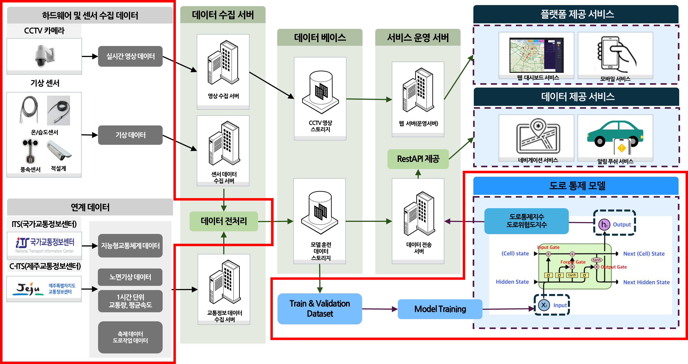

# **제주도 내 도로 위험도 예측을 통한 치안 공백 해소 프로젝트**  

<p align="center">
  
</p>

| 항목             | 내용                                                                 |
|------------------|----------------------------------------------------------------------|
| 프로젝트 기간     | 2023.05 – 2024.11                                                    |
| 참여 인원        | 4명                                                                   |
|🛠️ Model | LightGBM |

### 프로젝트 개요
```
도로 위험도 지수를 의미하는 KPI 정량적 지표 설계 후 이를 예측하기 위해서 노면 기상 정보와 교통 정보 데이터를 이용해 데이터셋을 구축한다.
이후 LightGBM 모델을 통해 0~1 사이의 도로 위험지수를 예측하고, 이를 5단계로 분할하여 f1-score로 평가한다.
```
### 역할  
- 도로통제 예측 알고리즘 개발 및 데이터 분석 전반 주도  
- 관할 기관과 협의하며 데이터 정의 및 수집 프로세스 설계 주도

### 프로젝트 배경

- 폭설 예보 시 **중산간도로 통제를 위해 경찰 인력의 약 40% 투입**, 이로 인한 타 지역 치안 공백 발생  
- **도로 통제 요인에 대한 실시간 예측체계 미흡**, 경찰 자원 비효율적 운용 문제


### 문제 해결 방법

1. 제주도 산간도로의 **노면 상태 및 기상 정보 수집 체계 구축**
2. **도로 통제 발생 이력** 및 **노면기상정보** 기반의 예측모델 설계
3. **LightGBM 기반** 위험도 지수 예측 모델 적용
4. 도로 위험도를 **1시간 단위로 예측**하여 경찰 대응 결정 지원

### 🚀 목표 및 성과

| 항목 | 기존 | 개선 | 성과 |
|------|-----------|------------|------|
| ⏱️ 통제 대응 속도 | 수작업 기반, 실시간 예측 불가 | 1시간 단위 도로 통제 예측 지수 산출 | **경찰 출동 사전 의사결정 체계 확보** |
| 📏 대응 기준 | 도로 상황 판단의 주관성 | 기상 및 노면정보 기반 정량 지표 | **표준화된 위험 예측 기반 대응** |
| 📊 위험도 분류 정확도 R1-score | 0.8 이상 목표 | 파생변수 생성 및 하이퍼파라미터 튜닝 | **F1-score 0.88 달성**  |

#### 🛠️ 사용기술 및 툴

<p>
  
  
  
  
  
  
</p>


#### 📌 Pain Point & 개선 방안

##### Pain Point 1: 도로 통제 이력 데이터 부족 및 비정형성
- 대부분의 도로통제 기록은 **문서 및 이미지 형태**로 수기 작성됨
- **일관된 데이터 구조 부족**으로 머신러닝 모델 학습에 제약 발생

> **해결 방법**
> - 도청 제공 이미지 및 한글 파일 **크롤링 자동화**
> - 텍스트 추출 및 정형 데이터 변환 자동화 적용
> - 신규 문서 자동 반영을 위한 **데이터 수집 파이프라인 구축**


##### Pain Point 2: 데이터 불균형으로 인한 예측모델 성능 저하
- 결빙/폭설에 따른 도로 통제 데이터 수가 현저히 적음
- 통제 없음 상황에 비해 예측 정확도 저조

> **해결 방법**
> - **데이터 오버샘플링** 및 클래스 균형 보정
> - 도로 위험도 구간화를 통한 **다중 분류 방식** 적용
> - LightGBM 회귀모델에서 **통제 지수 예측 후 구간화**


##### Pain Point 3: 기상 정보 결측 및 센서 데이터 미수집 항목 존재
- 적설량/결빙량 등 핵심 변수는 프로젝트 초기 수집되지 않음
- 일부 노면기상 센서 미작동 이슈 존재

**해결 방법**
> - 기상청 및 도청 협조로 **2차 데이터 수집**
> - 적설량/결빙량 포함한 **보완 통제 이력 데이터 확보**

##### Pain Point 4: 예측값의 직관성 부족으로 사용자 이해도 저하  
- 예측 모델이 산출한 **위험도 지표(0~1 사이의 확률값)** 가 사용자 및 사업 담당자에게 **직관적으로 해석되기 어려움**  
- 실제 활용 시 **의사결정 기준으로 사용되기 어려움**

> **해결 방법**  
> - 예측된 위험도 지표를 **1~5단계 구간으로 등급화**하여, **분류 모델처럼 직관적으로 표현**  
> - 사용자 인터페이스에 **등급별 색상 또는 라벨을 시각화하여 가독성 개선**  
> - 이를 통해 **정책 결정 및 현장 대응 판단에 실질적 도움 제공**
